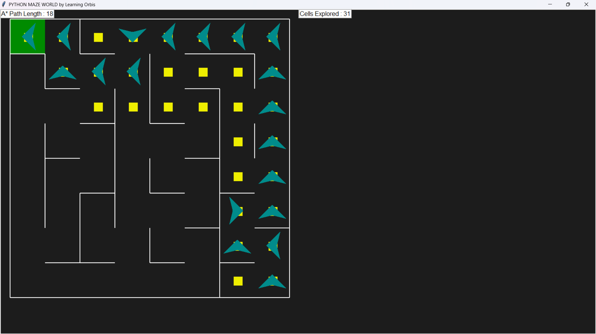
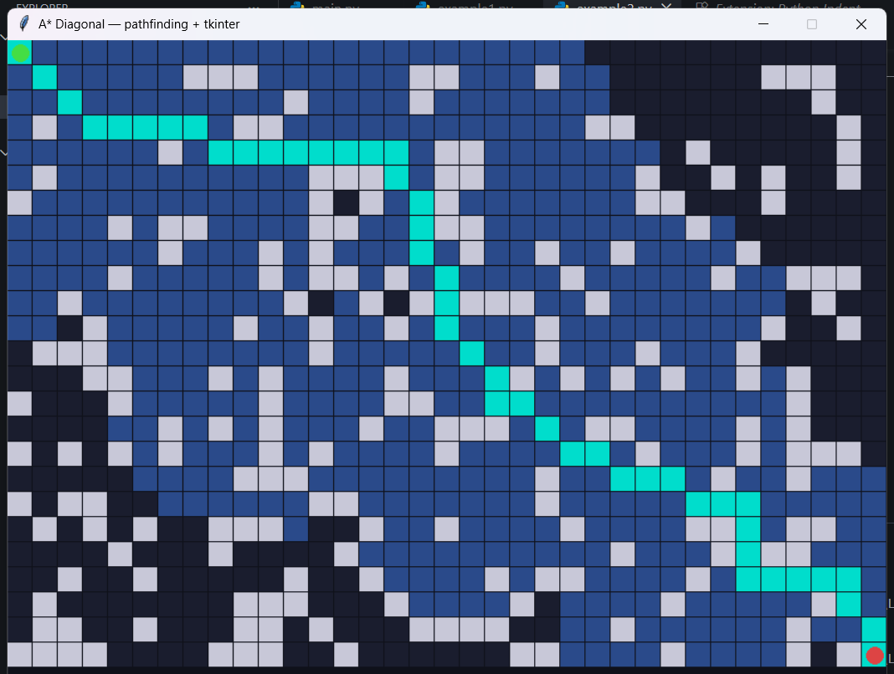

# A*, A-Priori Algorithm using Python

## A* Algorithm
### Example 1:
In `example1.py`, I used `pyamaze` library to visualize the travel of algorithm finding the optimal solution. It is limited to only 4 directions which is Norh, East, South, and West. Here is an example:

### Example 2:
In `example2.py`, I tried to implement the diagonal movement. In this case, I used `tkinter` library to visualize since `pyamaze` only allow the 4 directions. Here is the example:

