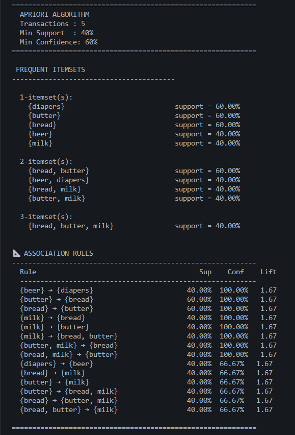
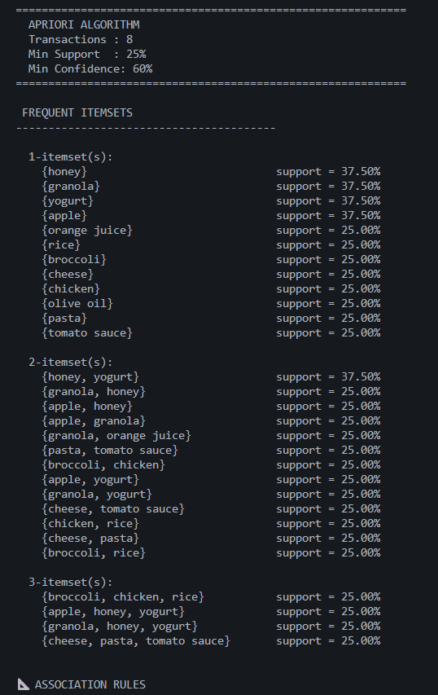
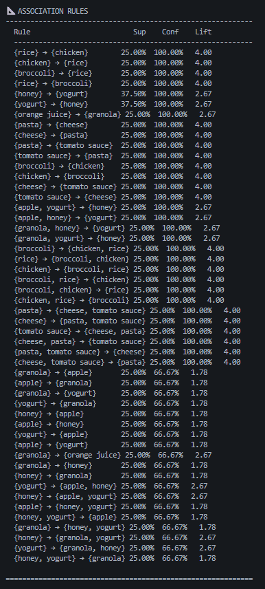
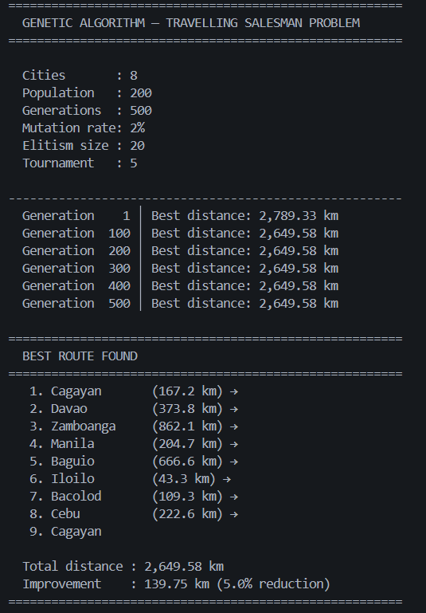
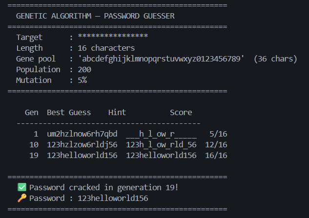

# A*, A-Priori, and Genetic Algorithm using Python

## A* Algorithm
### Example 1:
In `example1.py`, I used `pyamaze` library to visualize the travel of algorithm finding the optimal solution. It is limited to only 4 directions which is Norh, East, South, and West. Here is an example:

### Example 2:
In `example2.py`, I tried to implement the diagonal movement. In this case, I used `tkinter` library to visualize since `pyamaze` only allow the 4 directions. Here is the example:

## A-Priori Algorithm
### Example 1:
For `example1.py` of A-Priori algorithm, I only have 5 transactions with items "bread, butter, milk, beer, cookies, diapers". I set a `40%` minimum support and `60%` minimum confidence. Here is the result:

### Example 2:
For `example2.py`, I have 8 transactions with different items and set the minimum support to `25%` and minimum confidence to `60%`. Here is the result:

## Genetic Algorithm - Evolution Inspired
### Example 1:
For the first example, I used GA for solving the Travelling Salesman Problem. Here is the result:

### Example 2:
For second example, I implemented GA for a simple password guesser with 36 characters including alphanumeric symbols. Here is the result:

